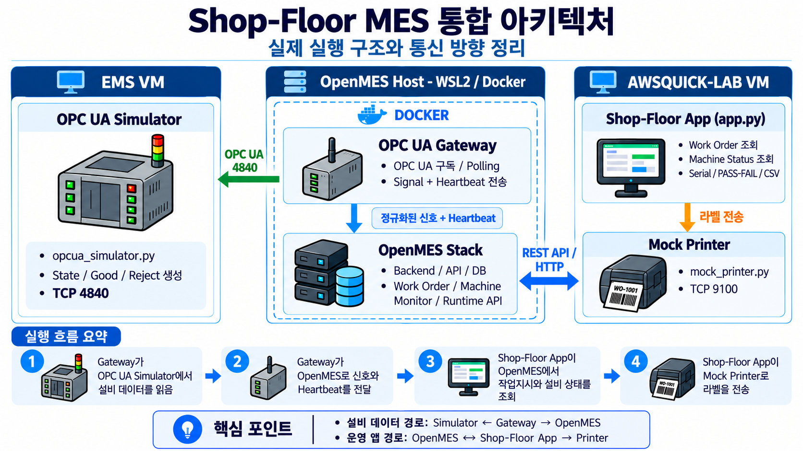

# Shop-Floor MES Integration & Fault Isolation Lab

[한국어 프로젝트 요약 PDF](./Manufacturing_IT_MES_Fault_Isolation_KR.pdf)

[English Project Summary PDF](./Manufacturing_IT_MES_Fault_Isolation_EN.pdf)

## Lab Architecture

**Connection initiation:** OPC UA Gateway → OPC UA Simulator  
**Machine data flow:** OPC UA Simulator → OPC UA Gateway → OpenMES  
**Shop-floor workflow:** OpenMES ↔ Shop-Floor App → Mock Printer

A hands-on Manufacturing IT lab that connects a shop-floor terminal to OpenMES.

The terminal retrieves a live work order and machine status from OpenMES, accepts serial-number scans and PASS/FAIL results, records production data to CSV, and sends a simulated Zebra-style label over TCP port 9100.

The lab also demonstrates machine communication fault detection using an OPC UA gateway heartbeat.

---

## What This Lab Demonstrates

- OpenMES REST API integration
- Laravel Sanctum API authentication
- Live work-order retrieval
- Machine status and production counter retrieval
- OPC UA gateway heartbeat monitoring
- Serial-number scanning
- PASS / FAIL production recording
- CSV production logging
- Label generation
- TCP 9100 printer communication
- Communication fault detection and recovery

---

---

## Quick Start

### 1. Generate API Token

Run on the OpenMES host:

    docker exec openmes-backend php artisan tinker --execute="\$u=App\Models\User::where('username','admin')->firstOrFail(); echo \"export OPENMES_TOKEN='\".\$u->createToken('shopfloor-device-lab')->plainTextToken.\"'\\n\";"

Copy the generated:

    export OPENMES_TOKEN='YOUR_TOKEN_HERE'

### 2. Set Token on Shop-Floor Terminal

Run on AWSQUICK-LAB:

    export OPENMES_TOKEN='YOUR_TOKEN_HERE'

### 3. Run Shop-Floor App

    python3 app.py

Normal communication:

    Communication: HEALTHY
    State: RUNNING

### 4. Run Mock Printer

In another AWSQUICK-LAB terminal:

    python3 mock_printer.py

The printer simulator listens on TCP port 9100.

---

## Fault Isolation Test

Stop the OPC UA gateway on the OpenMES host:

    docker stop openmes-opcua-gateway

After more than 20 seconds:

    Communication: HEARTBEAT LOST
    State: UNKNOWN
    Good: 0 (last known)
    Reject: 0 (last known)

Restart the gateway:

    docker start openmes-opcua-gateway

Communication recovers to:

    Communication: HEALTHY
    State: RUNNING

If the mock printer is not running:

    ERROR: Printer connection refused.

The production record is still saved, allowing the printer fault to be isolated from the MES transaction.

---

## Project Files

- app.py - Shop-floor terminal application
- mock_printer.py - TCP 9100 printer simulator
- production_log.csv - Sample production records
- label.zpl - Generated label example

---

## Portfolio Summary

Built a shop-floor production workflow integrating OpenMES work-order and machine-status data with serial scanning, PASS/FAIL recording, CSV production logging, simulated TCP label printing, and OPC UA gateway heartbeat fault detection.

The lab demonstrates normal operation, communication failure, fault isolation, and recovery across a Manufacturing IT / MES workflow.

Environment: Linux, Docker, OpenMES, REST API, Laravel Sanctum, OPC UA, Python, TCP/IP

Lab environment only. Not intended for production use.
